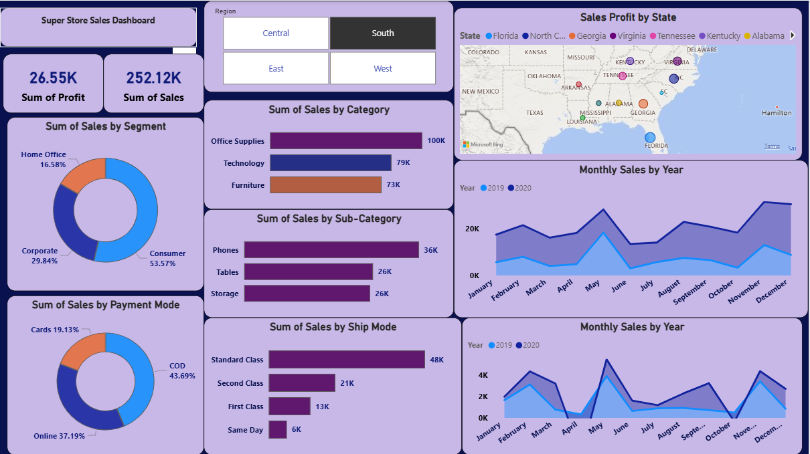
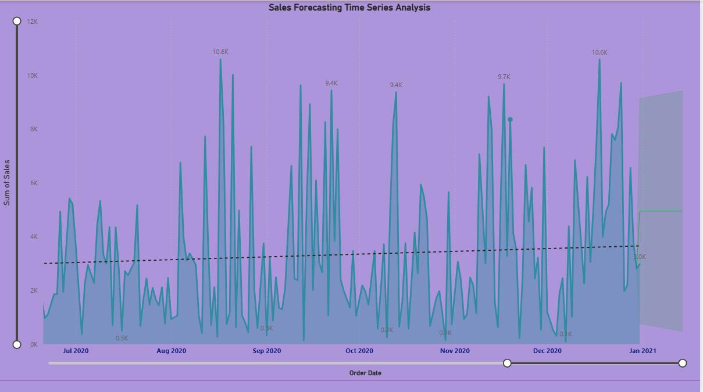
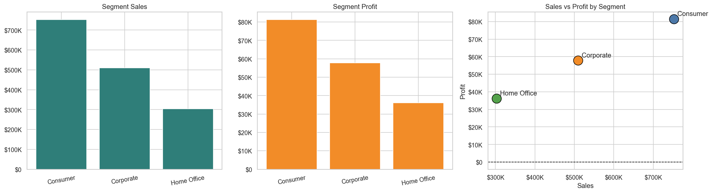
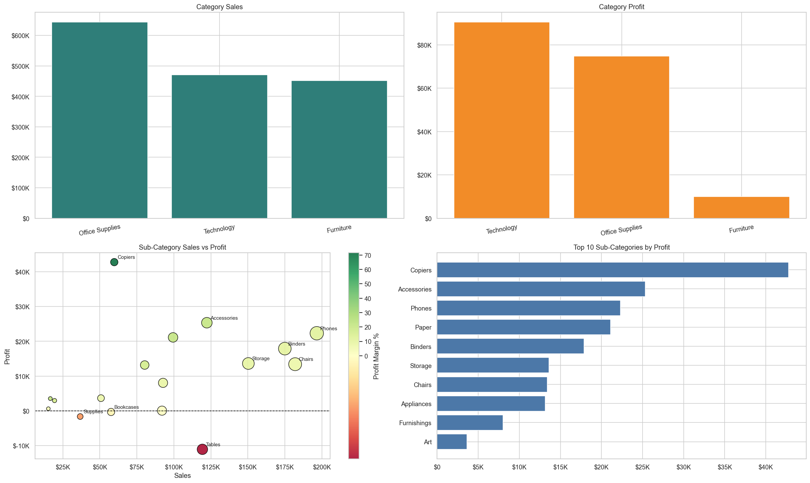
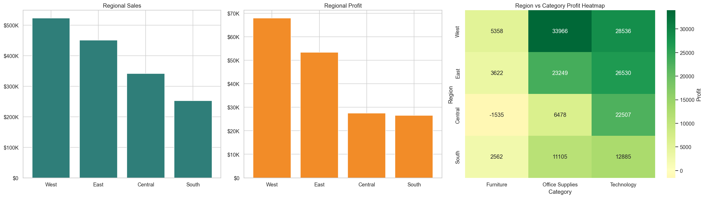
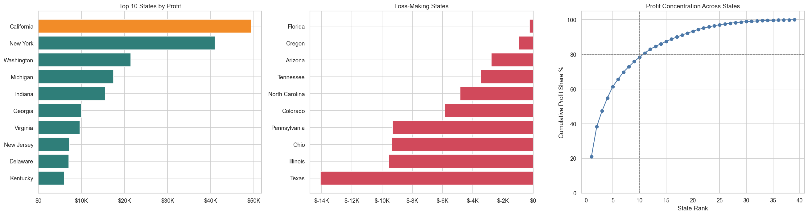
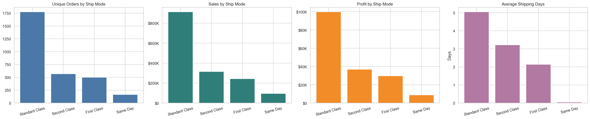
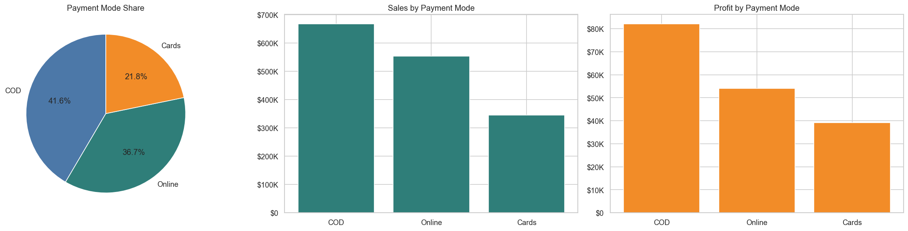
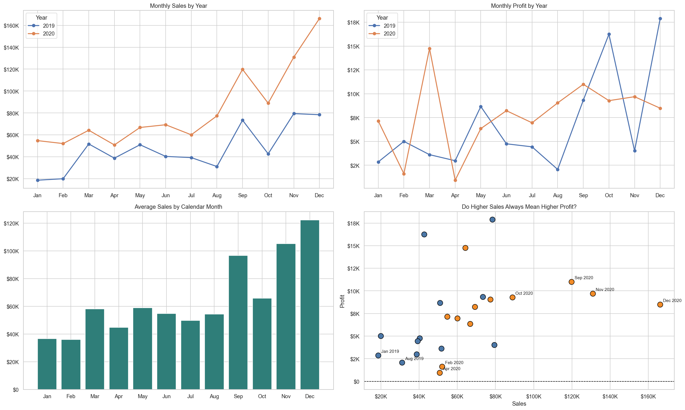
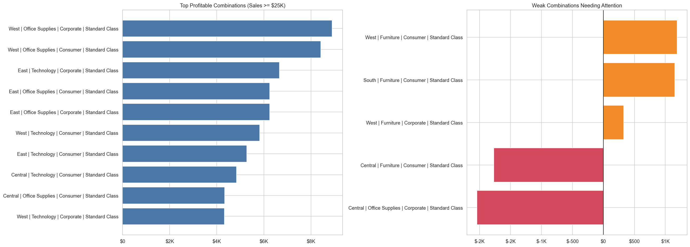

# <mark>**Super Store Sales Dashboard**<mark>

# **full dashboard PDF**
[Open Full Dashboard PDF](./superstore_sales_analysis_dashboardPDF.pdf)

# <mark>1. Overall Performance <mark>
What is the total sales and total profit?
Is the business profitable overall?
What is the profit margin (Profit / Sales)?
  total sales : 1565804.32
  total profit : 175262.11
  Profit Margin: 11.19 %

“The total sales are approximately 1.56 million, with a total profit of around 175 thousand. This indicates the business is profitable. However, the profit margin is about 11%, suggesting moderate efficiency. There is scope to improve profitability by optimizing cost-heavy areas like shipping modes, discounts, or underperforming categories.”

# <mark> 2. Segment Analysis<mark>

Which customer segment generates the highest sales?
Which segment is most profitable?
Is there any segment with high sales but low profit?
How does Consumer vs Corporate vs Home Office compare?

The Consumer segment is the top performer, generating the highest sales and profit, making it the most valuable segment for the business. The Corporate segment shows moderate performance with steady sales and profit, acting as a reliable contributor. Meanwhile, the Home Office segment has the lowest sales and profit but remains profitable, indicating potential for growth. Overall, all segments are performing efficiently with a clear positive relationship between sales and profit, and there is no segment with high sales but low profitability.
    
   # <mark>Overall Insights<mark>
    
    All segments are profitable and efficient
    Strong positive relationship between sales and profit
    No segment has high sales with low profitability

#  <mark> 3. Category & Sub-Category <mark>

Which category has the highest sales?
Which category contributes the most profit?
Which sub-category performs best (e.g., Phones, Chairs, Binders)?
Are there sub-categories with high sales but low profitability?

<mark>Category Performance<mark>

  **Office Supplies** has the highest sales, making it the top revenue-generating category
  **Technology** generates the highest profit, indicating better margins and efficiency
  **Furniture** has relatively good sales but very low profit, showing weak profitability

<mark>Profitability Insight<mark>

   **Technology is the most profitable category**, followed by Office Supplies
   **Furniture underperforms in profit**, suggesting high costs or heavy discounts

<mark>Sub-Category Highlights<mark>
  
  Copiers generate the highest profit among all sub-categories
  Other strong performers include Accessories, Phones, and Paper
  These sub-categories combine good sales with strong profitability
  
<mark>Low Profit / Loss Areas<mark>

  Tables show a loss despite having noticeable sales → major concern
  Bookcases and Supplies have low profitability relative to their sales
  These areas may need pricing or cost optimization
  
<mark>Sales vs Profit Trend<mark>
  Most sub-categories follow a positive trend (higher sales → higher profit)
  However, some exceptions (like Tables) break this pattern, indicating inefficiencies

<mark>meaningful insight<mark>
  Focus on Technology and high-profit sub-categories (Copiers, Phones, Accessories)
  Improve or rethink strategy for Furniture category, especially Tables
  Optimize pricing/discount strategies for low-profit sub-categories
  Leverage Office Supplies volume while improving its margins

# <mark> 4. Region Analysis <mark>

Which region (West, East, Central, South) has the highest sales?
Which region is most profitable?
Are there regions with losses or low performance?
Why might West region be performing better (if visible)?

# <mark> 5. State-Level Insights (Map)<mark>
Which states generate the highest profit?
Are there states with negative profit (loss)?
How does California compare to other states?
Is profit concentrated in a few states or spread evenly?

# <mark> 6. Ship Mode Analysis <mark>
Which shipping mode is most used?
Does faster shipping (First Class / Same Day) lead to higher sales?
Which shipping mode generates the most profit?
Is there a cost vs benefit tradeoff in shipping modes?

# <mark> 7. Payment Mode <mark>

Which payment mode is most preferred?
Does any payment method contribute to higher sales or profit?
What percentage of customers use COD vs Online vs Cards?

# <mark>8. Time Series (Monthly Sales) and. Profit Trends <mark>

How do sales trends change over months?
Which month has the highest sales?
Is there seasonality in sales?
How does 2019 compare to 2020?
Is there a growth trend over time?

Are profits consistent across months?
Are there months with losses?
Does higher sales always mean higher profit?

# <mark> 10. Business Insights (Advanced <mark> 
Which combination of:
Region + Category
Segment + Ship Mode
gives the best performance?
Where should the company focus to increase profit?
Which areas need cost reduction or strategy change?

…or create a new repository on the command line
echo "# Superstores_sales_analysis" >> README.md
git init
git add README.md
git commit -m "first commit"
git branch -M main
git remote add origin https://github.com/pinkimahato9814-afk/Superstores_sales_analysis.git
git push -u origin main

…or push an existing repository from the command line
git remote add origin https://github.com/pinkimahato9814-afk/Superstores_sales_analysis.git
git branch -M main
git push -u origin main
